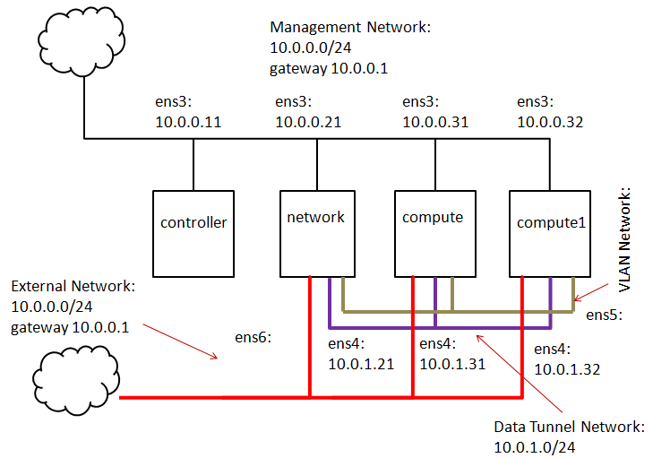

# openstack-queens-installer

Copyright 2018 Kasidit Chanchio 

Author: กษิดิศ ชาญเชี่ยว  
Contact: kasiditchanchio@gmail.com  

<h2>Tutorial: การติดตั้งระบบ OpenStack Queens แบบ Multi-node & DVR ด้วย installation scripts บน ubuntu 16.04 </h2>  

ให้ท่านเตรียมเครื่องตามส่วนที่ 1 และหลังจากนั้นเลือกเอาว่าจะติดตั้งด้วย scripts(ส่วนที่ 2) หรือด้วยมือ (ส่วนที่ 3)  
<ul>
 <li> 1. <a href="#part1">เตรียมเครื่องและเนตสำหรับติตดั้ง</a>
      <ul>
       <li> <a href="#kvmhost">1.1 การเตรียมเครื่องเพื่อติดตั้งบน KVM VM </a>
      </ul>
 <li> 2. <a href="#part2">ติดตั้งด้วย scripts</a> 
      <ul>
       <li> <a href="#downloadinstaller">2.1 ดาวน์โหลด openstack-queens-installer scripts</a>
       <li> <a href="#paramrc">2.2 กำหนดค่าพารามีเตอร์สำหรับการติดตั้ง </a>
       <li> <a href="#usescript">2.3 ติดตั้ง OpenStack queens ด้วย scripts </a> 
       <li> <a href="#addnodes">2.4 การเพิ่ม compute node ด้วย scripts </a>
      </ul>
 <li><a href="#part4">ส่วนที่ 4: สรุป</a>
</ul>
<table>
<tr><td><b>แจ้งปัญหาหรือข้อผิดพลาด:</b> หากมีส่วนใดของเเนื้อหาใน web นี้ที่เป็น BUGS หรือมีข้อแนะนำขอให้แจ้งได้ที่ kasiditchanchio@gmail.com นะครับ ขอบคุณครับ </td></tr>
</table>

<a id="part1"><h3>ส่วนที่ 1: เตรียมเครื่อง host และ networks สำหรับติดตั้ง</h3></a>

ในคู่มือนี้เราจะแนะนำการติดตั้งบนเครื่อง host จำนวนหนึ่งซึ่งมีลักษณะดังนี้
<ul>
  <li>เป็น host ที่ถูกสร้างขึ้นด้วย KVM hypervisor บนเครื่อง physical host (Ubuntu 16.04) เดียวกันจำนวน 4 เครื่อง
  <li>เป็น host ที่ถูกสร้างขึ้นด้วย virtualbox (vbox) hypervisor บนเครื่อง physical host (Windows 10) เดียวกันจำนวน 4 เครื่อง
</ul>

 <i><a id="kvmhost"><h4>1.1 การเตรียมเครื่องเพื่อติดตั้งบน KVM Virtual Machine (VM)</h4></a></i>

 
  ขอให้เตรียมเครื่อง ubuntu 16.04.x จำนวน 4 เครื่องเชื่อมต่อกันบนเนตดังภาพที่ 1 ได้แก่เครื่องชื่อ controller network compute และ compute1 (ชื่อเครื่องต้องตรงกับผลจากคำสั่ง hostname) จากภาพกำหนดให้เครื่องที่ controller มี spec แนะนำคือ cpu 4 cores RAM 6 ถึง 8 GB Disk 16-20 GB เครื่อง network มี cpu 1-2 cores RAM 512MB-1GB Disk 8-10 GB เครื่อง compute และ compute1 มี cpu 4 cores RAM 2-4 GB Disk 16-20 GB (เป็น spec ใช้สำหรับการศึกษา ถ้าจะ deploy ขอให้ดู official OpenStck document) 
  

    
   ภาพที่ 1  
กำหนดให้ทุกเครื่องมี username คือ opensatck และ password คือ openstack และเพื่อความสะดวกแนะนำว่าให้ทำให้ทุกเครื่องใช้ sudo โดยไม่ต้องป้อน password และอีกอย่างที่สำคัญคือเครื่องเหล่านี้ควรมีเวลาใกล้เคียงกัน

สำหรับเนต (network) ที่จะใช้ในการติดตั้ง เรา <b>ASSUME</b> เครื่อง VM ทั้ง 4 ในภาพมี  management network รวมทั้ง network gateway ที่ใช้งานได้แอยู่เรียบร้อยแล้ว และมี data tunnel network และ vlan network ที่พร้อมจะใช้เชื่อมต่อกับเครื่องที่จะติดตั้งเรียบร้อยแล้ว 
 <ul>
 <li> management network: มี cidr 10.0.0.0/24 และ gateway คือ 10.0.0.1 OpenStack ใช้เนตนี้เป็นเนตหลักเพื่อส่งคำสั่งระหว่างโหนดทั้ง 4 เครื่องของมัน  
 <li> data tunnel network: ใช้สร้าง VXLAN หรือ GRE tunneling networks  สำหรับส่งข้อมูลระหว่าง VMs ที่จะถูกสร้างขึ้นภายในระบบ openstack (east-west) และระหว่าง VMs กับ Virtual Rounters เพื่อออก internet 
 <li> vlan network: ใช้ส่งข้อมูลระหว่าง vm ภายใน openstack กับ VM หรือเครื่องจริงบน vlan network ภายนอก openstack 
 <li> external network: คือเนตที่เป็น internet service provider ของ openstack ซึ่งในที่นี้เราจะใช้ management network 
 </ul>
จากภาพที่ 1 สมมุตว่า NIC ที่ 1 คือ ens3 NIC ที่ 2 คือ ens4 NIC ที่ 3 คือ ens5 NIC ที่ 4 คือ ens6 จะเห็นว่าเครื่อง conroller มี ens3 อันเดียว เครื่อง network compute และ compute1 ทั้งหมด มี ens3 ถึง ens6  

<table>
<tr><td> 

[กดเพื่อดูรายละเอียด] รายละเอียดการติดตั้งบน host แบบ KVM VM 
 
  
เพื่อให้การติดตั้งเร็วขึ้น ให้กำหนดค่า apt configuration ของเครื่องต่างๆให้ใช้ ubuntu repository ในประเทศไทย โดยกำหนดค่าใน /etc/apt/sources.list ด้วยมือ หรือใช้คำสั่ง sed ข้างล่าง บน openstack node ทุกเครื่อง 
<pre>
 $ sudo sed -i "s/us.arch/th.arch/g" /etc/apt/sources.list
 $ sudo apt-get update
</pre>
และให้ dist-upgrade ทุกเครื่องด้วย 
<pre>
$ sudo dist-upgrade 
</pre>
ให้กำหนด network configuration ของทุกเครื่องบน management network ดังตัวอย่างข้างล่าง (<b>เรา ASSUME ว่าทุก interface มี MTU คือ 1500 bytes</b>) 

 

 <b>เครื่อง controller </b> 
<pre>
openstack@controller:~$ cat /etc/network/interfaces
...
auto lo
iface lo inet loopback
...
auto ens3
iface ens3 inet static
address 10.0.0.11
netmask 255.255.255.0
network 10.0.0.0
gateway 10.0.0.1
dns-nameservers 8.8.8.8

openstack@controller:~$
</pre>
<pre>
openstack@controller:~$ ifconfig
ens3      Link encap:Ethernet  HWaddr 00:54:09:25:20:17
          inet addr:10.0.0.11  Bcast:10.0.0.255  Mask:255.255.255.0
          inet6 addr: fe80::254:9ff:fe25:2017/64 Scope:Link
          UP BROADCAST RUNNING MULTICAST  MTU:1500  Metric:1
          RX packets:17777 errors:0 dropped:0 overruns:0 frame:0
          TX packets:12906 errors:0 dropped:0 overruns:0 carrier:0
          collisions:0 txqueuelen:1000
          RX bytes:5715989 (5.7 MB)  TX bytes:2963058 (2.9 MB)

lo        Link encap:Local Loopback
          inet addr:127.0.0.1  Mask:255.0.0.0
          inet6 addr: ::1/128 Scope:Host
          UP LOOPBACK RUNNING  MTU:65536  Metric:1
          RX packets:160 errors:0 dropped:0 overruns:0 frame:0
          TX packets:160 errors:0 dropped:0 overruns:0 carrier:0
          collisions:0 txqueuelen:1
          RX bytes:11840 (11.8 KB)  TX bytes:11840 (11.8 KB)
openstack@controller:~$
</pre>
<pre>
openstack@controller:~$ ip link
1: lo: <LOOPBACK,UP,LOWER_UP> mtu 65536 qdisc noqueue state UNKNOWN mode DEFAULT group default qlen 1
    link/loopback 00:00:00:00:00:00 brd 00:00:00:00:00:00
2: ens3: <BROADCAST,MULTICAST,UP,LOWER_UP> mtu 1500 qdisc pfifo_fast state UP mode DEFAULT group default qlen 1000
    link/ether 00:54:09:25:20:17 brd ff:ff:ff:ff:ff:ff
openstack@controller:~$
</pre>

 <b>เครื่อง network </b>
<pre>
openstack@network:~$ cat /etc/network/interfaces
...
auto lo
iface lo inet loopback
...
auto ens3
iface ens3 inet static
address 10.0.0.21
netmask 255.255.255.0
network 10.0.0.0
gateway 10.0.0.1
dns-nameservers 8.8.8.8
openstack@network:~$
</pre>

<pre>
openstack@network:~$ ifconfig
ens3      Link encap:Ethernet  HWaddr 00:54:09:25:21:17
          inet addr:10.0.0.21  Bcast:10.0.0.255  Mask:255.255.255.0
          inet6 addr: fe80::254:9ff:fe25:2117/64 Scope:Link
          UP BROADCAST RUNNING MULTICAST  MTU:1500  Metric:1
          RX packets:4053 errors:0 dropped:0 overruns:0 frame:0
          TX packets:3014 errors:0 dropped:0 overruns:0 carrier:0
          collisions:0 txqueuelen:1000
          RX bytes:4715574 (4.7 MB)  TX bytes:255812 (255.8 KB)

lo        Link encap:Local Loopback
          inet addr:127.0.0.1  Mask:255.0.0.0
          inet6 addr: ::1/128 Scope:Host
          UP LOOPBACK RUNNING  MTU:65536  Metric:1
          RX packets:160 errors:0 dropped:0 overruns:0 frame:0
          TX packets:160 errors:0 dropped:0 overruns:0 carrier:0
          collisions:0 txqueuelen:1
          RX bytes:11840 (11.8 KB)  TX bytes:11840 (11.8 KB)

openstack@network:~$

</pre>
<pre>
openstack@network:~$ ip link
1: lo: <LOOPBACK,UP,LOWER_UP> mtu 65536 qdisc noqueue state UNKNOWN mode DEFAULT group default qlen 1
    link/loopback 00:00:00:00:00:00 brd 00:00:00:00:00:00
2: ens3: <BROADCAST,MULTICAST,UP,LOWER_UP> mtu 1500 qdisc pfifo_fast state UP mode DEFAULT group default qlen 1000
    link/ether 00:54:09:25:21:17 brd ff:ff:ff:ff:ff:ff
3: ens4: <BROADCAST,MULTICAST> mtu 1500 qdisc noop state DOWN mode DEFAULT group default qlen 1000
    link/ether 00:54:09:25:21:18 brd ff:ff:ff:ff:ff:ff
4: ens5: <BROADCAST,MULTICAST> mtu 1500 qdisc noop state DOWN mode DEFAULT group default qlen 1000
    link/ether 00:54:09:25:21:19 brd ff:ff:ff:ff:ff:ff
5: ens6: <BROADCAST,MULTICAST> mtu 1500 qdisc noop state DOWN mode DEFAULT group default qlen 1000
    link/ether 00:54:09:25:21:16 brd ff:ff:ff:ff:ff:ff
openstack@network:~$
</pre>

 <b>เครื่อง compute </b>
<pre>
openstack@compute:~$ cat /etc/network/interfaces
...
auto lo
iface lo inet loopback
...
auto ens3
iface ens3 inet static
address 10.0.0.31
netmask 255.255.255.0
network 10.0.0.0
gateway 10.0.0.1
dns-nameservers 8.8.8.8
openstack@compute:~$
</pre>
<pre>
openstack@compute:~$ ifconfig
ens3      Link encap:Ethernet  HWaddr 00:54:09:25:31:17
          inet addr:10.0.0.31  Bcast:10.0.0.255  Mask:255.255.255.0
          inet6 addr: fe80::254:9ff:fe25:3117/64 Scope:Link
          UP BROADCAST RUNNING MULTICAST  MTU:1500  Metric:1
          RX packets:16953 errors:0 dropped:0 overruns:0 frame:0
          TX packets:10473 errors:0 dropped:0 overruns:0 carrier:0
          collisions:0 txqueuelen:1000
          RX bytes:23969227 (23.9 MB)  TX bytes:771168 (771.1 KB)
lo        Link encap:Local Loopback
          inet addr:127.0.0.1  Mask:255.0.0.0
          inet6 addr: ::1/128 Scope:Host
          UP LOOPBACK RUNNING  MTU:65536  Metric:1
          RX packets:160 errors:0 dropped:0 overruns:0 frame:0
          TX packets:160 errors:0 dropped:0 overruns:0 carrier:0
          collisions:0 txqueuelen:1
          RX bytes:11840 (11.8 KB)  TX bytes:11840 (11.8 KB)
openstack@compute:~$
</pre>
<pre>
openstack@compute:~$ ip link
1: lo: <LOOPBACK,UP,LOWER_UP> mtu 65536 qdisc noqueue state UNKNOWN mode DEFAULT group default qlen 1
    link/loopback 00:00:00:00:00:00 brd 00:00:00:00:00:00
2: ens3: <BROADCAST,MULTICAST,UP,LOWER_UP> mtu 1500 qdisc pfifo_fast state UP mode DEFAULT group default qlen 1000
    link/ether 00:54:09:25:31:17 brd ff:ff:ff:ff:ff:ff
3: ens4: <BROADCAST,MULTICAST> mtu 1500 qdisc noop state DOWN mode DEFAULT group default qlen 1000
    link/ether 00:54:09:25:31:18 brd ff:ff:ff:ff:ff:ff
4: ens5: <BROADCAST,MULTICAST> mtu 1500 qdisc noop state DOWN mode DEFAULT group default qlen 1000
    link/ether 00:54:09:25:31:19 brd ff:ff:ff:ff:ff:ff
5: ens6: <BROADCAST,MULTICAST> mtu 1500 qdisc noop state DOWN mode DEFAULT group default qlen 1000
    link/ether 00:54:09:25:31:16 brd ff:ff:ff:ff:ff:ff
openstack@compute:~$
</pre>

 <b>เครื่อง compute1 </b>
<pre>
openstack@compute1:~$ cat /etc/network/interfaces
...
auto lo
iface lo inet loopback
...
auto ens3
iface ens3 inet static
address 10.0.0.32
netmask 255.255.255.0
network 10.0.0.0
gateway 10.0.0.1
dns-nameservers 8.8.8.8
openstack@compute1:~$

</pre> 
<pre>
openstack@compute1:~$ ifconfig
ens3      Link encap:Ethernet  HWaddr 00:54:09:25:32:17
          inet addr:10.0.0.32  Bcast:10.0.0.255  Mask:255.255.255.0
          inet6 addr: fe80::254:9ff:fe25:3217/64 Scope:Link
          UP BROADCAST RUNNING MULTICAST  MTU:1500  Metric:1
          RX packets:16827 errors:0 dropped:0 overruns:0 frame:0
          TX packets:9776 errors:0 dropped:0 overruns:0 carrier:0
          collisions:0 txqueuelen:1000
          RX bytes:24038372 (24.0 MB)  TX bytes:693719 (693.7 KB)
lo        Link encap:Local Loopback
          inet addr:127.0.0.1  Mask:255.0.0.0
          inet6 addr: ::1/128 Scope:Host
          UP LOOPBACK RUNNING  MTU:65536  Metric:1
          RX packets:160 errors:0 dropped:0 overruns:0 frame:0
          TX packets:160 errors:0 dropped:0 overruns:0 carrier:0
          collisions:0 txqueuelen:1
          RX bytes:11840 (11.8 KB)  TX bytes:11840 (11.8 KB)
openstack@compute1:~$
</pre>
<pre>
openstack@compute1:~$ ip link
1: lo: <LOOPBACK,UP,LOWER_UP> mtu 65536 qdisc noqueue state UNKNOWN mode DEFAULT group default qlen 1
    link/loopback 00:00:00:00:00:00 brd 00:00:00:00:00:00
2: ens3: <BROADCAST,MULTICAST,UP,LOWER_UP> mtu 1500 qdisc pfifo_fast state UP mode DEFAULT group default qlen 1000
    link/ether 00:54:09:25:32:17 brd ff:ff:ff:ff:ff:ff
3: ens4: <BROADCAST,MULTICAST> mtu 1500 qdisc noop state DOWN mode DEFAULT group default qlen 1000
    link/ether 00:54:09:25:32:18 brd ff:ff:ff:ff:ff:ff
4: ens5: <BROADCAST,MULTICAST> mtu 1500 qdisc noop state DOWN mode DEFAULT group default qlen 1000
    link/ether 00:54:09:25:32:19 brd ff:ff:ff:ff:ff:ff
5: ens6: <BROADCAST,MULTICAST> mtu 1500 qdisc noop state DOWN mode DEFAULT group default qlen 1000
    link/ether 00:54:09:25:32:16 brd ff:ff:ff:ff:ff:ff
openstack@compute1:~$
</pre>

ขอให้ make sure ว่าท่านสามารถใช้ NIC ทุกอันส่งข้อมูลได้ ท่านอาจใช้วิธี ping IP address ใน management network โดยเช็คว่าสามารถ ping จาก controller ผ่าน ens3 ไปยัง IP ของ ens3 บนเครื่องอื่นทุกๆเครื่องได้ 

สำหรับการเช็คความถูกต้องของ networks ที่ต่อกับ ens4 ens5 ens6 <b>ท่านอาจแอบกำหนดค่า IP</b> (หมายถึงกำหนดแล้วลบทิ้ง คือกำหนดเพื่อเช็คต่อไปนี้เฉยๆ แล้วลบทิ้ง ifdown หรือ ifconfig down ก่อนติดตั้งในส่วนที่ 2 หรือ 3) ให้กับ ensx interface ทุกๆอันที่เหลือและให้เช็คว่า ens4 IP ของทุกเครื่องสามารถ ping กันได้ และ ens5 IP ของทุกเครื่องสามารถ ping กันได้ และ ens6 IP ของทุกเครื่อง ping กันและกันได้ 

<b>หมายเหตุ</b> ขอให้ระวังว่า ens4 IP ไม่ควร ping ens3 IP หรือ ens5 IP หรือ ens6 IP ได้ พูดอีกอย่างคือ  data tunnel network subnet และ vlan network subnet และ management network subnet ต้องแยก (isolate) จากกัน 

เมื่อเช็คเสร็จแล้วให้ ลบ และ ifdown หรือ ifconfig down IP address ของ ens4 ens5 ens6 บนทุกเครื่องออก เราจะใช้ installation scripts กำหนดค่า หรือกำหนดค่าเองด้วยมือภายหลัง   

</td></tr> 
</table>

<table>
<tr><td>

<b>[กดเพื่อดูรายละเอียด] ในกรณีที่ท่านใช้ btrfs: การสร้าง snapshot บน btrfs บน ubuntu 16.04 host</b>

เนื้อหาในส่วนนี้ใช้สำหรับผู้ที่ประสงค์ใช้ btrfs เป๋น file system ของ host computers ที่จะใช้ติดตั้ง openstack และต้องการทำ snapshot ของ partition ที่ใช้ในการติดตั้งบนแต่ละเครื่องเป็นระยะๆ ถ้าท่านไม่ได้ใช้ btrfs ก็ให้ข้ามส่วนนี้ไป

ท่านสามารถติดตั้ง btrfs บน ubuntu 16.04 บนเครื่อง controller network compute compute1 hosts ระหว่างการติดตั้ง OS เมื่อกำหนด disk partitioning
<ul>
<li>

[กดเพื่อดูรายละเอียด] ภาพ setup btrfs ที่ 1 
 
  

    

<li>

[กดเพื่อดูรายละเอียด] ภาพ setup btrfs ที่ 2
 
  

    

<li>

[กดเพื่อดูรายละเอียด] ภาพ setup btrfs ที่ 3
 
  

    

<li>

[กดเพื่อดูรายละเอียด] ภาพ setup btrfs ที่ 4
 
  

    

<li>

[กดเพื่อดูรายละเอียด] ภาพ setup btrfs ที่ 5
 
  

    

<li>

[กดเพื่อดูรายละเอียด] ภาพ setup btrfs ที่ 6
 
  

    

<li>

[กดเพื่อดูรายละเอียด] ภาพ setup btrfs ที่ 7
 
  

    

<li>

[กดเพื่อดูรายละเอียด] ภาพ setup btrfs ที่ 8
 
  

    

</ul>
หลังจากนั้นให้ติดตั้ง ubuntu ต่อตามปกติ 

เมื่อติดตั้งเสร็จแล้ว ให้ท่าน login เข้าสู่เครื่องนั้นและดู btrfs subvolume ที่มีอยู่ในเครื่อง host ซึ่งหลังจากการติดตั้งข้างต้น ubuntu 16.04 จะสร้าง btrfs subvolmes สำหรับ / และ /home directory ให้ตั้งแต่เริ่มต้น
<pre>
$ sudo su
# df -h
Filesystem      Size  Used Avail Use% Mounted on
udev            2.0G     0  2.0G   0% /dev
tmpfs           396M  5.5M  390M   2% /run
/dev/sda1        10G  2.0G  6.3G  25% /
tmpfs           2.0G     0  2.0G   0% /dev/shm
tmpfs           5.0M     0  5.0M   0% /run/lock
tmpfs           2.0G     0  2.0G   0% /sys/fs/cgroup
/dev/sda1        10G  2.0G  6.3G  25% /home
tmpfs           396M     0  396M   0% /run/user/1000
# 
# mount /dev/sda1 /mnt 
#
</pre>
ท่านต้อง modify ไฟล์ /etc/fstab ด้วยการเพิ่มบรรทัดข้างล่าง เพื่อให้มีการสร้าง /mnt directory และ mount เข้ากับ /dev/sda1 device โดยอัตโนมัติเมื่อมีการ reboot

<pre>
# vi /etc/fstab
...
/dev/sda1       /mnt            btrfs   defaults   0    1
...
(ให้เซฟไฟล์ และออกจาก vi)
#
</pre>
ในอันดับถัดไปให้ list btrfs subvolume ซึ่ง ubuntu จะสร้าง subvolume /mnt/@ สำหรับ / directory และ /mnt/@home สำหรับ /home directory

<pre>
# btrfs subvolume list /mnt
ID 261 gen 7810 top level 5 path @
ID 262 gen 7702 top level 5 path @home
#
</pre>
ท่านสามารถทำ defragmentation ด้วยคำสั่งต่อไปนี้

<pre>
# btrfs filesystem defrag /mnt
</pre>
ท่านสามารถทำ snapshot ของ /mnt/@ และ /mnt/@home ดังนี้

<pre>
# <b>btrfs subvolume snapshot /mnt/@ /mnt/@_snapshot1</b>
Create a snapshot of '/mnt/@' in '/mnt/@_snapshot1'
# <b>btrfs subvolume snapshot /mnt/@home /mnt/@home_snapshot1</b>
Create a snapshot of '/mnt/@home' in '/mnt/@home_snapshot1'
# btrfs subvolume list /mnt
ID 261 gen 7812 top level 5 path @
ID 262 gen 7813 top level 5 path @home
ID 264 gen 7812 top level 5 path @_snapshot1
ID 265 gen 7813 top level 5 path @home_snapshot1
#
</pre>
หลังจากนั้น ถ้าท่านติดตั้ง openstack แล้วเกิดความผืดพลาดขึ้น ท่านสามารถกู้คืน / และ /home ด้วยคำสั่งต่อไปนี้ 

<pre>
# mv /mnt/@ /mnt/@_badroot
# mv /mnt/@home /mnt/@_badhome
# mv /mnt/@_snapshot1 /mnt/@
# mv /mnt/@home_snapshot1 /mnt/@home
#
# reboot
</pre>
เมื่อ reboot เสร็จแล้ว ให้ login เข้าเครื่อง sudo เป็น root แล้ว ลบ /mnt/@_badroot และ /mnt/@_badhome

<pre>
# btrfs subvolume delete /mnt/@_badroot
# btrfs subvolume delete /mnt/@_badhome
</pre>
หลังจากนั้นให้สร้าง snapshot ของ /mnt/@ และ /mnt/@home อีกครั้งหนึ่ง

<pre>
# btrfs subvolume snapshot /mnt/@ /mnt/@_snapshot1
# btrfs subvolume snapshot /mnt/@home /mnt/@home_snapshot1
# btrfs filesystem defrag /mnt
</pre>
ผม recommend ให้ทุกท่านทำ snapshot ของ /mnt/@ และ /mnt/@home เมื่อผ่านการติดตั้งที่สำคัญๆ เผื่อว่าการติดตั้งในอนาคตผิดพลาด นศ จะได้ recover snapshot ล่าสุดได้

</td></tr>
</table>

 <i><a id="kvmhost"><h4>1.2 การเตรียมเครื่องเพื่อติดตั้งบน Virtualbox VM</h4></a></i>

TBA

<a id="part2"> 
<h3>ส่วนที่ 2: ติดตั้งด้วย scripts</h3>
</a>

<i><a id="downloadinstaller"><h4>2.1 ดาวน์โหลด openstack-queens-installer scripts</h4></a></i>

นศ จะใช้เครื่อง controller เป็นหลักในการติดตั้งด้วย script เริ่มต้นด้วยการ login เข้า openstack user (makes sure ว่า username และ password คือ "openstack" บนทุกเครื่อง) และ download script ด้วยคำสั่ง 
<pre>
$ cd $HOME
$ git clone https://github.com/kasidit/openstack-queens-installer
$ cd openstack-queens-installer
</pre>

เมื่อดู content ของ directory จะมีไฟล์และ subdirectory ดังนี้
<pre>
$ ls
config.d   exe-config-installer.sh  LICENSE                README.md
documents  example.install-paramrc.sh install-paramrc.sh       OPSInstaller-init.tar
$
</pre> 

<i><a id="paramrc"><h4>2.2 กำหนดค่าพารามีเตอร์สำหรับการติดตั้ง </h4></a></i>

ต่อไป ท่านจะกำหนด configuration parameters สำหรับการติดตั้งโดยกำหนดค่าในไฟล์ <a href="https://github.com/kasidit/openstack-queens-installer/blob/master/install-paramrc.sh">install-paramrc.sh</a> ซึ่งถ้าท่านกำหนดค่า vm และเนตตามที่ระบุใน ส่วนที่ 1.1 และติดตั้งบน host ที่เป็น vm ที่รองรับ kvm nested virtualization (ที่ใช้รหัส ensXX โดยที่ XX เป็นตัวเลข positive interger เป็นชื่อ NIC) ท่านก็สามารถใช้ไฟล์ install-paramrc.sh นี้ได้เลย 

 <i><a id="kvmhost"><h4>2.2.1 กำหนดค่าโดยใช้ไฟล์ตัวอย่างสำหรับ KVM host หรือ vbox host</h4></a></i>

เรามีตัวอย่าง install-paramrc.sh สำหรับการติดตั้งบน host แบบอื่นๆใน directory <a href="https://github.com/kasidit/openstack-queens-installer/tree/master/example.install-paramrc.sh"><b>example.install-paramrc.sh</b></a> ดังตารางต่อไปนี้
<table>
<tr>
   <th> No. </th>
   <th> Filename </th>
   <th> ชนิด Host VM</th>
   <th> ชนิด VM Hypervisor ที่รันบน Host</th>
   <th> หมายเหตุ </th>
</tr>
<tr>
   <th> 1 </th>
   <th> install-paramrc.sh.kvm.on_kvm_hosts </th>
   <th> Host เป็น VM ที่สร้างด้วย KVM </th>
   <th> ใช้ KVM เป็น hypervisor</th>
   <th> Physical Host มี Nested Virt </th>
</tr>
<tr>
   <th> 2 </th>
   <th> install-paramrc.sh.kvm.on_vbox_hosts </th>
   <th> Host เป็น VM ที่สร้างด้วย virtualbox </th>
   <th> ใช้ KVM เป็น hypervisor</th>
   <th> Physical Host มี Nested Virt </th>
</tr>
<tr>
   <th> 3 </th>
   <th> install-paramrc.sh.qemu.on_kvm_hosts </th>
   <th> Host เป็น VM ที่สร้างด้วย KVM </th>
   <th> ใช้ qemu เป็น hypervisor</th>
   <th> Physical Host ไม่มี Nested Virt </th>
</tr>
<tr>
   <th> 4 </th>
   <th> install-paramrc.sh.qemu.on_vbox_hosts </th>
   <th> Host เป็น VM ที่สร้างด้วย virtualbox </th>
   <th> ใช้ qemu เป็น hypervisor</th>
   <th> Physical Host ไม่มี Nested Virt  
        <b>ในการติดตั้งบน vbox ส่วนใหญ่จะใช้ไฟล์นี้</b> </th>
</tr>
</table>
โดย default แล้วไฟล์ <a href="https://github.com/kasidit/openstack-queens-installer/blob/master/install-paramrc.sh">install-paramrc.sh</a> จะเป็นแบบที่ 1 

ในกรณีที่ท่านใช้ virtualbox สร้าง Host VM ทั้ง 4 ใน section 1.1 ชื่อ interfaces ต่างๆจะเปลี่ยนไป และท่านจะต้องใช้ไฟล์ install-paramrc.sh.qemu.on_vbox_hosts มาเป็น install-paramrc.sh โดย copy มาทับของเดิมด้วยคำสั่ง
<pre>
$ ls
config.d   exe-config-installer.sh  LICENSE                README.md
documents  example.install-paramrc.sh install-paramrc.sh       OPSInstaller-init.tar
$
$ cp example.install-paramrc.sh/install-paramrc.sh.qemu.on_vbox_hosts  install-paramrc.sh
$
</pre>

 <i><a id="kvmhost"><h4>2.2.2 กำหนดค่าโดยใช้ไฟล์ตัวอย่างสำหรับเครื่อง physical host หรือ host VM อื่นๆ</h4></a></i>

ในกรณีที่ท่านติดตั้งบน Host ที่เป็น Physical Host คือเป็นเครื่องจริง ชื่อ NICs และค่าอื่นๆก็จะเปลี่ยนไป ซึ่งผมจะอธิบายความหมายของตัวแปรต่างๆในไฟล์ install-paramrc.sh เพื่อที่จะได้กำหนดค่าอย่างถูกต้องดังต่อไปนี้ 

อันดับแรก environment variables สามตัวแรกในไฟล์นี้ได้แก่
<pre>
export INSTALL_TYPE=full
export NETWORK_TYPE=dvr_ovs
export PASSWD_TYPE=studypass
</pre>
มีความหมายดังนี้ INSTALL_TYPE เป็นแบบ "full" คือเป็นการติดั้งแบบ 4 nodes ถ้าเปลี่ยนค่าเป็น "compact" จะหมายถึงติดตั้งแบบ 3 nodes ได้แก่ controller network และ compute ส่วน NETWORK_TYPE เป็นตัวแปรที่ระบุชนิดของ network deployment ถ้ากำหนดค่าเป็น "dvr_ovs" หมายถึงใช้ neutron ที่สร้างด้วย openvswitch และปฏิบัติงานแบบ Distributed Virtual Router (DVR) ซึ่งเป็น default configuration ถ้าเปลี่ยนค่าเป็น "classic_ovs" จะหมายถีง neutron ที่สร้างด้วย openvswitch ซึ่งจะปฏิบัติงานแบบธรรมดา ไม่มี DVR high availabiility feature สำหรับตัวแปร PASSWD_TYPE เป็นตัวแปรที่ระบุชนิดของ password ที่จะถูกกำหนดสำหรับการติดตั้ง component ต่างๆของ openstack ถ้า่าเป็น "studypass" หมายถึงการกำหนดค่า password ที่เป็น string ธรรมดาที่สื่อความหมายว่าเป็น password ของ component ใด (เหมือนที่ใช้เป็นตัวอย่างในคู่มือการติดตั้ง official) ในทางตรงกันข้าม ถ้ากำหนดค่าเป็น "randompass" จะหมายถึงการกำหนดค่า password สำหรับการติดตั้ง component เหล่านั้นให้เป็นตัวเลข random ซึ่งเหมาะสมสำหรับ production deployment
<table>
<tr><td>

[กดเพื่อดูรายละเอียด] การกำหนดค่า parameters ในไฟล์ install-paramrc.sh 
 
  

<pre>
export OPS_LOGIN_NAME=openstack
export OPS_LOGIN_PASS=openstack
export OPS_TIMEZONE=Asia\\/Bangkok
</pre>
ตัวแปร OPS_LOGIN_NAME และ OPS_LOGIN_PASS ในที่นี้เรากำหนดให้เป็น "openstack" ทั้งคู่ ค่า OPS_LOGIN_NAME และ OPS_LOGIN_PASS นี้ต้องตรงกับชื่อ login name และค่า password ของ Linux account ที่ ท่านจะใช้ติดตั้ง OpenStack บนทุก node ส่วน OPS_TIMEZONE นั้นใช้กำหนดค่ว TIMEZONE ซึ่งในทีนี้คือ Asia/Bangkok

อันดับถัดไปคือการกำหนดค่า root password ของ mysql <b>ซึ่งท่านจะต้องจำด้วยว่ากำหนดค่าตัวแปรนี้</b> เพราะในระหว่างการติดตั้ง ท่านจะต้องป้อนค่านี้ด้วยตนเองอีกครั้งหนึ่ง สำหนับ DEMO_PASS และ ADMIN_PASS คือค่า password ของ "demo" user และ "admin" user ที่เราจะสร้างขึ้นเพื่อทดสอบระบบในระหว่างการติดตั้งและหลังจากการติดตั้งเสร็จสิ้น 
<pre>
export OPS_MYSQL_PASS=mysqlpassword
export DEMO_PASS=demopassword
export ADMIN_PASS=adminpassword
#
export HYPERVISOR=qemu
</pre>
ถัดจจากนั้นจะเป็นการกำหนดค่า HYPERVISOR  ในกรณีที่ ท่านติดตั้งบนเครื่องจริง หรือบน vm ที่ทำ nested virtualization ได้ให้เปลี่ยนค่าของตัวแปรนี้เป็น "kvm" แต่ถ้าท่านติดจั้งบนเครื่อง vm ที่ไม่สนับสนุน nested virtualization ให้กำหนดค่าเป็น "qemu" โดย defualt เราจะกำหนดให้เป็น "qemu"

สำหรับตัวแปรถัดไปต่อไปนี้ ท่านอาจไม่ต้องไปยุ่งกับมันก็ได้ มันเป็นการกำหนดค่า url ของ cirros OS image ที่ script จะไป download มา ตัวแปร LOCAL_REPO เป็นการกำหนดค่า apt repository และตัวแปร NTP_SERVER เป็นตัวแปรกำหนดค่า NTP server ซึ่งถ้าติดตั้งในเมืองไทยคงไม่ต้องเปลี่ยนอะไร
<pre>
export INIT_IMAGE_LOCATION=http:\\/\\/download.cirros-cloud.net\\/0.3.5\\/cirros-0.3.5-x86_64-disk.img
export INIT_IMAGE_NAME=cirros
#
export DOMAINNAME=cs.tu.ac.th
#
# Ubuntu Repository Parameters
#
export LOCAL_REPO=th.archive.ubuntu.com
export LOCAL_SECURITY_REPO=security.ubuntu.com
#
# ntp servers
export NTP_SERVER0=0.th.pool.ntp.org
export NTP_SERVER1=1.th.pool.ntp.org
export NTP_SERVER2=2.th.pool.ntp.org
export NTP_SERVER3=3.th.pool.ntp.org
#
</pre>

อันดับถัดไปจะเป็นการกำหนดค่า network configuration ในกรณีที่ ท่านจะติดตั้งด้วย script และต้องการกำหนดค่าตัวแปรที่แตกต่างจากที่ระบุในส่วนที่ 1 ท่านควรทราบความหมายของตัวแปรเหล่านี้ 

<b>[กดเพื่อดูรายละเอียด] ภาพที่ 3 แสดงการ mapping ของค่าตัวแปรใน install-paramrc.sh กับค่า network configuration ในภาพที่ 1</b>
 
  

    
  

    
   ภาพที่ 3  

จากภาพ ตัวแปรต่อไปนี้ใช้กำหนดค่าของ management network 
<pre>
export MANAGEMENT_NETWORK_NETMASK=255.255.255.0
export MANAGEMENT_NETWORK=10.0.0.0
export MANAGEMENT_BROADCAST_ADDRESS=10.0.0.255 
export DNS_IP=8.8.8.8
</pre>

ตัวแปร CONTROLLER_IP และ CONTROLLER_IP_NIC ใช้ระบุค่า IP address และ NIC แรกของเครื่อง controller และตัวแปร GATEWAY_IP ใช้ระบุค่า IP address ของ gateway router ของ management network (ซึ่งในที่นี้จะหมายถึง IP address ของ gateway router ของ external network ด้วย เพราะเราจะใช้ management network เป็น external network ในกรณีศึกษานี้)
<pre>
export CONTROLLER_IP=10.0.0.11
export CONTROLLER_IP_NIC=ens3
#
export GATEWAY_IP=10.0.0.1
</pre>

ต่อไปเป็นการกำหนดค่า IP address ของ network node (ตัวแปร NETWORK_IP) และค่า NIC ของ network node ที่เชื่อมกับ management network (NETWORK_NODE_IP_NIC) ถัดจากนั้นจะเป็นการกำหนดค่าตัวแปรสำหรับ NIC ที่เชื่อมต่อ Data tunnel network ของ network node ได้แก่ DATA_TUNNEL_NETWORK_NODE_IP และ DATA_TUNNEL_NETWORK_NODE_IP_NIC และ DATA_TUNNEL_NETWORK_ADDRESS และ DATA_TUNNEL_NETWORK_NETMASK 
<pre>
export NETWORK_IP=10.0.0.21
export NETWORK_IP_NIC=ens3
#
export DATA_TUNNEL_NETWORK_NODE_IP=10.0.1.21
export DATA_TUNNEL_NETWORK_NODE_IP_NIC=ens4
export DATA_TUNNEL_NETWORK_ADDRESS=10.0.1.0
export DATA_TUNNEL_NETWORK_NETMASK=255.255.255.0
</pre>
นอกจากเชื่อมต่อกับ management และ data tunnel network แล้ว network node ยังต่อกับ Vlan network และ External network ด้วยซึ่ง เราจะกำหนดค่าของทั้งสอง network ดังนี้
<pre>
export VLAN_NETWORK_NODE_IP_NIC=ens5
#
export EXTERNAL_CIDR=10.0.0.0\\/24
export EXTERNAL_CIDR_NIC=ens6
export EXTERNAL_GATEWAY_IP=10.0.0.1
#
export START_FLOATING_IP=10.0.0.100
export END_FLOATING_IP=10.0.0.200
</pre>

จะเห็นว่า การกำหนดค่าของ vlan network นั้นไม่ต้องทำอะไรมาก แค่กำหนดค่าตัวแปร VLAN_NETWORK_NODE_IP_NIC เพื่อระบุว่า NIC ไหนบน network node เชื่อมต่อกับ Vlan network (openstack จะมี CLI ให้ผู้ใช้ๆกำหนดค่าของ vlan network เองหลังจากการติดตั้ง)  

ส่วนตัวแปร EXTERNAL_CIDR_NIC คือการบอก OpenStack ว่า NIC ไหนบน network node ที่จะใช้ติดต่อกับ network ที่ติดต่อกับ Internet ได้ (หรือ External network) 
และเนื่องจากเครื่อง compute และ compute1 ก็มี NIC ต่อกับ External network เช่นกันในกรณีของระบบ network แบบ DVR เราจะใช้ค่าของตัวแปร EXTERNAL_CIDR_NIC ตัวแปรเดียวกันนี้เพื่อกำหนดค่า NIC ดังกล่าวสำหรับ network compute และ compute1 node ไปด้วยเลย

ท่านจะต้องระบุ CIDR ของ External network (ด้วยตัวแปร EXTERNAL_CIDR) ซึ่งในการติดตั้งนี้เราจะใช้ CIDR ของ management network 

หลังจากนั้น ท่านต้องกำหนดค่า range ของ Floating IP โดยให้ตัวแปร START_FLOATING_IP เป็นค่า IP address เริ่มต้น และตัวแปร END_FLOATING_IP เป็นค่า IP address สุดท้ายซึ่งเรากำหนดค่าให้เป็น 10.0.0.100 และ 10.0.0.200 ตามลำดับ ใน script จะเรียกใช้ openstack CLI เพื่อสร้าง network และกำหนดค่าหล่านี้ให้  

ท่านต้องระบุค่าตัวแปร COMPUTE_NODE_IP เพื่อกำหนดค่า IP address บน management network ของ compute node และกำหนดค่า COMPUTE_NODE_IP_NIC เพื่อระบุว่า NIC ไหนของ compute node ที่ใช้ต่อกับ management network ตัวแปร DATA_TUNNEL_COMPUTE_NODE_IP และ DATA_TUNNEL_COMPUTE_NODE_IP_NIC ใช้กำหนดค่า IP address และ NIC ที่เชื่อมต่อกับ data tunnel network ส่วน VLAN_COMPUTE_NODE_IP_NIC ใช้ระบุค่า NIC ที่เชื่อมต่อกับ Vlan network
<pre>
export COMPUTE_IP=10.0.0.31
export COMPUTE_IP_NIC=ens3
export DATA_TUNNEL_COMPUTE_NODE_IP=10.0.1.31
export DATA_TUNNEL_COMPUTE_NODE_IP_NIC=ens4
export VLAN_COMPUTE_NODE_IP_NIC=ens5
</pre>
ในไฟล์ install-paramrc.sh เรากำหนดค่าตัวแปรสำหรับ compute1 node ในแบบเดียวกันกับการกำหนดค่าของ compute node ข้างต้น 

</td></tr>
</table>

<i><a id="usescript"><h4>2.3 การติดตั้ง OpenStack queens ด้วย scripts </h4></a></i>

เริ่มต้นการติดตั้งด้วยคำสั่งต่อไปนี้ (หมายเหตุ ท่านผู้อ่านต้องออกคำสั่งใน user mode คือเป็น openstack user ห้ามใช้ sudo จนจบ script เหล่านี้) 
<pre>
$ cd $HOME/openstack-queens-installer
$ ./exe-config-installer.sh
</pre>
คำสั่ง ./exe-config-installer.sh จะนำค่าที่กำหนดใน install-paramrc.sh ไปแทนค่า template ของ scripts สำหรับติดตั้ง openstack ในไฟล์ OPSInstaller-init.tar และสร้าง directory ใหม่ชือ OPSInstaller ขึ้น (ดู <a href="https://www.youtube.com/watch?v=zIVLVEvaDgs&list=PLmUxMbTCUhr4vYsaeEKVkvAGF5K1Tw8oJ&index=4">youtube video</a>)

จาก directory $HOME/openstack-queens-installer ที่ท่านอยู่ในปัจจุบัน ให้ cd เข้าสู่ directory installer ดังนี้ 
<pre>
$ cd OPSInstaller/installer
</pre>
เริ่มต้นการติดตั้ง ท่านจะรัน OS-installer-00-1-update-ubuntu.sh script เพื่อทำให้ scripts ที่ขะใช้ในอันดับถัดไปสามารถ remote exeution ด้วย ssh จากเครื่อง controller ไปยังเครื่องอื่นๆได้โดยไม่ต้องใส่ password (<b>หมายเหตุ:</b> ในกรณีที่ท่านผู้อ่านจะใช้ script ติดตั้งเพื่อใช้งานจริง หลังจากติดตั้งเสร็จเรียบร้อยแล้ว ท่านต้องทำสองอย่างได้แก่ (1) เปลี่ยน password ของ openstack user บนทุกเครื่องและ (2) ลบไฟล์ $HOME/.ssh/id_rsa บนเครื่อง controller และไฟล์ $HOME/.ssh/authorized_keys ของ openstack user บนทุกๆเครื่อง) (ดู <a href="https://www.youtube.com/watch?v=zIVLVEvaDgs&list=PLmUxMbTCUhr4vYsaeEKVkvAGF5K1Tw8oJ&index=4">youtube video</a>)
<pre>
$ ./OS-installer-00-1-set-remote-access.sh
</pre>
หลังจากนั้นให้รัน OS-installer-00-2-update-ubuntu.sh script เพื่อ update ubuntu 16.04 บนโหนดต่างๆให้เป็นเวอรชันล่าสุดและกำหนด cloud repository สำหรับ openstack queens installation
<pre>
$ ./OS-installer-00-2-update-ubuntu.sh 
</pre>
script นี้จะ remote ssh เข้าไปที่เครื่อง controller network compute และ compute1 และ update ubuntu repository ของแต่ละเครื่องให้ใช้ openstack queens repository หลังจาก script update ubuntu บนแต่ละเครื่องเสร็จมันจะ reboot เครื่องเหล่านั้น โดยจะ reboot เครื่อง controller เป็นเครื่องสุดท้าย (เพราะเราใช้เครื่อง controller ไป update และ reboot เครื่องอื่นๆก่อน)

หลังจากนั้น เราจะ login เข้าสู่เครื่อง controller แต่ก่อนที่จะรัน script ถัดไป ขอให้ท่าน make sure ว่าทุกเครื่อง reboot เสร็จและสามารถ ssh ได้
<pre>
host$ ssh openstack@10.0.0.11
openstack@10.0.0.11's password:
$
$ cd openstack-queens-installer/OPSInstaller/installer/
$ 
</pre>

<table>
<tr><td>

<b>[กดเพื่อดูรายละเอียด] ในกรณีที่ท่านใช้ btrfs: ท่านสามารถใช้ script ทำ snapshot ของทั้ง cluster ได้</b>

ท่านจะใช้ ./OS-cluster-btrfs-snapshot.sh script ด้วย option snapshot ตามด้วยชื่อ "OSi-00" เพื่อสร้าง snapshots สำหรับ / และ /home file systems และให้ชื่อว่า /mnt/@_snap_OSi-00 และ /mnt/@home_snap_OSi-00 ตามลำดับ ผม recommend ให้ท่านทำ snapshot ทุกครั้งหลังจากรัน installer script ในแต่ละขั้นเสร็จ
<pre>
$  ./OS-cluster-btrfs-snapshot.sh snapshot OSi-00
On controller:
+ btrfs subvolume snapshot /mnt/@ /mnt/@_snap_OSi-00
Create a snapshot of '/mnt/@' in '/mnt/@_snap_OSi-00'
+ btrfs subvolume snapshot /mnt/@home /mnt/@home_snap_OSi-00
Create a snapshot of '/mnt/@home' in '/mnt/@home_snap_OSi-00'
Connection to controller closed.
On network:
+ btrfs subvolume snapshot /mnt/@ /mnt/@_snap_OSi-00
Create a snapshot of '/mnt/@' in '/mnt/@_snap_OSi-00'
+ btrfs subvolume snapshot /mnt/@home /mnt/@home_snap_OSi-00
Create a snapshot of '/mnt/@home' in '/mnt/@home_snap_OSi-00'
Connection to network closed.
On compute:
+ btrfs subvolume snapshot /mnt/@ /mnt/@_snap_OSi-00
Create a snapshot of '/mnt/@' in '/mnt/@_snap_OSi-00'
+ btrfs subvolume snapshot /mnt/@home /mnt/@home_snap_OSi-00
Create a snapshot of '/mnt/@home' in '/mnt/@home_snap_OSi-00'
Connection to compute closed.
On compute1:
+ btrfs subvolume snapshot /mnt/@ /mnt/@_snap_OSi-00
Create a snapshot of '/mnt/@' in '/mnt/@_snap_OSi-00'
+ btrfs subvolume snapshot /mnt/@home /mnt/@home_snap_OSi-00
Create a snapshot of '/mnt/@home' in '/mnt/@home_snap_OSi-00'
Connection to compute1 closed.
Done!
$
</pre>
Recommend ให้ท่านทำ snapshot ของทั้ง cluster (ถ้าท่านใช้ btrfs) สมมุติว่าผมต้องการตั้งชื่อของ snapshot หลังจากทำการติดตั้งแต่ละขั้นเสร็จว่า OSi-XX หมายถึง OpenStack installation หลังจากขั้นที่ XX เสร็จ เช่นเมื่อทำ ./OS-installer-01-node-setups.sh เสร็จ ผมก็จะป้อนคำสั่งเพื่อสร้าง snapshot คือ

<pre>
$ ./OS-cluster-btrfs-snapshot.sh snapshot OSi-01
</pre>

</td></tr>
</table>

ในอันดับถัดไป เราจะเริ่มต้นด้วยการกำหนดค่า network configurations ที่จำเป็นสำหรับการติดตั้ง openstack ด้วย OS-installer-01-node-setups.sh ซึ่งจะกำหนดค่าและ ifup interfaces ต่างๆบนทุกๆเครื่องในภาพที่ 1 และติดตั้ง chrony เพื่อ sync เวลาระหว่าง NTP server กับ controller และระหว่าง controller กับทุกๆ node 
<pre>
$ ./OS-installer-01-node-setups.sh
</pre>

ในขั้นถัดไป ท่านจะติดตั้ง mysql ด้วย script OS-installer-02-mysql.sh 
<pre>
$ ./OS-installer-02-mysql.sh
</pre>
ที่สำคัญคือ ขอให้ท่านจำรหัสผ่านสำหรับ root ของ mysql ที่กำหนดไว้ใน install-paramrc.sh (ในที่นี้คือ "mysqlpassword") เพื่อใช้ระหว่างที่รัน script นี้ <b>และท่านจะต้องระวังและป้อนค่าตามที่ script ต้องการตามอันดับ</b>ดังนี้
<ul>
<li> หลังจากติดตั้ง mysql แล้ว script จะถามว่าให้ป้อนค่า root password ดังนี้ "Enter current password for root (enter for none):" ซึ่งไม่มีเพราะเป็นการติดตั้งใหม่ ดังนั้น ท่านต้อง กด <b>ENTER</b>
<li> ถัดจากนั้นมันจะถามว่าจะใส่พาสเวิดไหม ให้ป้อน password (<b>mysqlpassword</b>) สองครั้ง
<pre>
Set root password? [Y/n] y
New password:
Re-enter new password:
</pre>
<li> คำถามที่เหลือ เขาถามอะไรมาก็ตอบ y ให้หมด 
<pre>
Remove anonymous users? [Y/n] y
...
Disallow root login remotely? [Y/n] y
...
Remove test database and access to it? [Y/n] y
...
Reload privilege tables now? [Y/n] y
...
</pre>
เตือนความจำอีกครั้งว่า ถ้าท่านใช้ btrfs ท่านควรทำ cluster snapshot ของทุกเครื่อง โดยใช้ script ที่กล่าวถึงไปก่อนหน้านี้
</ul>

ในขั้นถัดไปท่านจะติดตั้ง rabbitmq ซึ่งเป็น AMQP message queue software ที่ components ของ openstack ใช้สื่อสารกัน 
<pre>
$ ./OS-installer-03-rabbitmq.sh
</pre>
ถัดจากนั้นจะติดตั้ง keystone ซึ่งเป็น component ที่รับผิดชอบเรื่องการทำ Authentication และ Authorization 
<pre>
$ ./OS-installer-04-keystone.sh
</pre>
ตามด้วย glance เพื่อจัดการ vm images โดยที่ glance จะสร้าง repository สำหรับเก็บ Disk images ของ vm ซึ่งจะมี Guest OS แบบต่างๆเช่น ubuntu และ centOS ติดตั้งอยู่เป็นต้น เบื้องแรกหลังจากติดตั้ง glance software เสร็จแล้ว script จะ download cirros image มาจาก internet และ upload เข้าระบบ glance ให้เป็น image เริ่มต้นสำหรับการติดตั้งนี้ 
<pre>
$ ./OS-installer-05-glance.sh
</pre>
ขั้นตอนถัดไปเป็นการติดตั้ง component ที่สำคัญที่สุดของ openstack คือ nova ซึ่งเป็นระบบบริหารจัดการ vms บน cluster computer ทั้ง cluster ที่ใช้รัน openstack 
<pre>
$ ./OS-installer-06-nova.sh
</pre>
และถัดจากนั้นคือ neutron ที่จะจัดการ virtual networks ทั้งหมด รวมทั้งการสื่อสารระหว่าง vms ภายใน OpenStack และระหว่าง vms เหล่านั้นกับ internet หลังจากรัน script เสร็จ ท่านจะได้ neutron network service แบบ multi-node ที่มี network node หนึ่ง network node ที่ให้บริการ network virtualization แบบ provider network และ self-service network ระบบ network ในการติดตั้งของเราปฏิบัติงานบน openvswitch และ VXLAN technology 
<pre>
$ ./OS-installer-07-neutron.sh
</pre>
script ถัดไปจะทำให้ neutron network service ที่เพิ่งติดตั้งปฏิบัติการแบบ Distributed Virtual Router (DVR) ซึ่งเป็น High Availability network service ของ nuetron ที่เป็นประโยชน์มากสำหรับ datacenters ที่ให้บริการ web servers แก่ลูกค้า DVR ทำให้ web servers ที่รันอยู่บน compute nodes สามารถปฏิบัติงานต่อได้แม้ว่าเครื่อง controller หรือเครื่อง network เกิดปัญหา offline 
<pre>
$ ./OS-installer-08-set-dvr.sh
</pre>
หลังจากรัน script ท่านควรจะเห็นข้อความต่อไปนี้ 
<pre>
...snip...
...
+ openstack compute service list
+----+------------------+------------+----------+---------+-------+----------------------------+
| ID | Binary           | Host       | Zone     | Status  | State | Updated At                 |
+----+------------------+------------+----------+---------+-------+----------------------------+
|  1 | nova-scheduler   | controller | internal | enabled | up    | 2018-06-13T11:16:44.000000 |
|  2 | nova-consoleauth | controller | internal | enabled | up    | 2018-06-13T11:16:41.000000 |
|  3 | nova-conductor   | controller | internal | enabled | up    | 2018-06-13T11:16:44.000000 |
|  7 | nova-compute     | compute    | nova     | enabled | up    | 2018-06-13T11:16:40.000000 |
|  8 | nova-compute     | compute1   | nova     | enabled | up    | 2018-06-13T11:16:44.000000 |
+----+------------------+------------+----------+---------+-------+----------------------------+
+ openstack network agent list
+--------------------------------------+--------------------+----------+-------------------+-------+-------+---------------------------+
| ID                                   | Agent Type         | Host     | Availability Zone | Alive | State | Binary                    |
+--------------------------------------+--------------------+----------+-------------------+-------+-------+---------------------------+
| 0ee141ee-939e-4a1b-8a0c-6a9abc727d31 | L3 agent           | compute1 | nova              | :-)   | UP    | neutron-l3-agent          |
| 165d635f-8daf-4cd4-ae10-25fa70bf9048 | Metadata agent     | compute  | None              | :-)   | UP    | neutron-metadata-agent    |
| 179399e3-80a8-4cbb-85a0-d49a9574b64e | L3 agent           | compute  | nova              | :-)   | UP    | neutron-l3-agent          |
| 196f111e-dd92-4a55-a94c-85d22f6af2a6 | L3 agent           | network  | nova              | :-)   | UP    | neutron-l3-agent          |
| 2121c8d1-4f54-4568-838a-91f13894f366 | Open vSwitch agent | compute1 | None              | :-)   | UP    | neutron-openvswitch-agent |
| 4e9c6f13-0182-4c94-bf3e-19fc43a68e22 | Open vSwitch agent | compute  | None              | :-)   | UP    | neutron-openvswitch-agent |
| 5460a660-dd90-47c7-8751-c256ae01c50f | DHCP agent         | compute1 | nova              | :-)   | UP    | neutron-dhcp-agent        |
| 9c930864-52d4-4e18-a873-a2889584e3e4 | Open vSwitch agent | network  | None              | :-)   | UP    | neutron-openvswitch-agent |
| adf02c5e-1ab3-476b-9acc-4e85baf7efcf | DHCP agent         | compute  | nova              | :-)   | UP    | neutron-dhcp-agent        |
| ca2babe5-9d4a-4daf-b544-60e0efcaccaa | Metadata agent     | compute1 | None              | :-)   | UP    | neutron-metadata-agent    |
+--------------------------------------+--------------------+----------+-------------------+-------+-------+---------------------------+
Connection to controller closed.
next run ./OS-installer-09-initial-user-network.sh
$
</pre>
เนื่องจากความซับซ้อนของ neutron หลังจากการติดตั้งข้างต้น เราจะใช้ script ถัดไปเพื่อสร้าง network เริ่มต้นและเริ่มทดสอบความถูกต้องของ network ที่สร้างขึ้น
<pre>
$ ./OS-installer-09-initial-user-network.sh
</pre>
หลังจากรัน script นี้ขอให้สังเกตุข้อความ ping ต่อไปนี้ว่าทำได้หรือไม่ การติดตั้ง neutron ที่ถูกต้อง ท่านจะต้องเห็นข้อความผลของการ ping เช่นนี้
<pre>
...snip...
...
Ping 10.0.0.100
+ ping -c 4 10.0.0.100
PING 10.0.0.100 (10.0.0.100) 56(84) bytes of data.
64 bytes from 10.0.0.100: icmp_seq=1 ttl=64 time=2.20 ms
64 bytes from 10.0.0.100: icmp_seq=2 ttl=64 time=0.916 ms
64 bytes from 10.0.0.100: icmp_seq=3 ttl=64 time=0.792 ms
64 bytes from 10.0.0.100: icmp_seq=4 ttl=64 time=0.901 ms

--- 10.0.0.100 ping statistics ---
4 packets transmitted, 4 received, 0% packet loss, time 2999ms
rtt min/avg/max/mdev = 0.792/1.203/2.204/0.580 ms
...
</pre>
หลังจากนั้นเราจะใช้ script ถัดไปติดตั้ง horizon web gui (ถ้าเครื่อง cpu หรือ memory น้อย ผมแนะนำให้ใช้ CLI แทน web interface คือไม่ต้องติดตั้ง horizon ดังคำสั่งข้างล่าง) 
<pre>
$ ./OS-installer-10-horizon.sh
</pre>
ท่านจะได้ ubuntu openstack dashbord โดย default

<i><a id="addnodes"><h4>2.4 การเพิ่ม Compute node ด้วย scripts </h4></a></i>

ก่อนอื่นเราสมมุติว่าท่านมีเครื่อง ubuntu 16.04 จำนวน 1 เครื่องอยู่โดยที่เรา Assume ว่าทั้งสองเครื่องนั้นมี network interfaces เหมือนกับ compute1 ก่อนที่ compute1 จะได้รับการรัน scripts ของเราใดๆ และกำหนดให้เครื่องมีรายละเอียดที่แตกต่างจาก compute1 ดังนี้
<ul>
 <li>hostname: compute-2-1, Managenent Network IP: 10.0.0.41, Data Tunnel Network IP: 10.0.1.41
 <li>hostname: compute-2-2, Managenent Network IP: 10.0.0.42, Data Tunnel Network IP: 10.0.1.42
 <li>hostname: compute-2-3, Managenent Network IP: 10.0.0.43, Data Tunnel Network IP: 10.0.1.43
</ul>

ผมได้เพิ่ม compute-2-1 และ compute-2-2 ไปแล้ว ในที่นี่ผมจะแสดงการเพิ่ม compute-2-3 

ในอันดับแรกเราจะเตรียมเครื่อง compute-2-3 ก่อน โดยมีรายละเอียดดังนี้
<pre>
$ ifconfig
ens3      Link encap:Ethernet  HWaddr 00:54:09:3c:1c:17
          inet addr:10.0.0.43  Bcast:10.0.0.255  Mask:255.255.255.0
          inet6 addr: fe80::254:9ff:fe3c:1c17/64 Scope:Link
          UP BROADCAST RUNNING MULTICAST  MTU:1500  Metric:1
          RX packets:223 errors:0 dropped:0 overruns:0 frame:0
          TX packets:198 errors:0 dropped:0 overruns:0 carrier:0
          collisions:0 txqueuelen:1000
          RX bytes:314544 (314.5 KB)  TX bytes:22413 (22.4 KB)

lo        Link encap:Local Loopback
          inet addr:127.0.0.1  Mask:255.0.0.0
          inet6 addr: ::1/128 Scope:Host
          UP LOOPBACK RUNNING  MTU:65536  Metric:1
          RX packets:160 errors:0 dropped:0 overruns:0 frame:0
          TX packets:160 errors:0 dropped:0 overruns:0 carrier:0
          collisions:0 txqueuelen:1
          RX bytes:11840 (11.8 KB)  TX bytes:11840 (11.8 KB)
$
$
$ ip link
1: lo: <LOOPBACK,UP,LOWER_UP> mtu 65536 qdisc noqueue state UNKNOWN mode DEFAULT group default qlen 1
    link/loopback 00:00:00:00:00:00 brd 00:00:00:00:00:00
2: ens3: <BROADCAST,MULTICAST,UP,LOWER_UP> mtu 1500 qdisc pfifo_fast state UP mode DEFAULT group default qlen 1000
    link/ether 00:54:09:3c:1c:17 brd ff:ff:ff:ff:ff:ff
3: ens4: <BROADCAST,MULTICAST> mtu 1500 qdisc noop state DOWN mode DEFAULT group default qlen 1000
    link/ether 00:54:09:3c:1c:18 brd ff:ff:ff:ff:ff:ff
4: ens5: <BROADCAST,MULTICAST> mtu 1500 qdisc noop state DOWN mode DEFAULT group default qlen 1000
    link/ether 00:54:09:3c:1c:19 brd ff:ff:ff:ff:ff:ff
5: ens6: <BROADCAST,MULTICAST> mtu 1500 qdisc noop state DOWN mode DEFAULT group default qlen 1000
    link/ether 00:54:09:3c:1c:16 brd ff:ff:ff:ff:ff:ff
$
</pre>

หลังจากนั้นจะเริ่มต้นการติดตั้ง โดนที่ท่านสามารถใช้คำสั่งต่อไปนี้้

 <b>บนเครื่อง controller node:</b>
<pre>
$ cd $HOME/openstack-queens-installer/OPSInstaller/installer
$ <b>./OS-newcompute-00-set-new-node.sh    compute-2-3    10.0.0.43    10.0.1.43   10.0.0.11</b>
...
$
</pre>
script ข้างต้นเป็นตอนแรกของการเพิ่ม host เข้า openstack ซึ่งท่านจะต้องใส่พารามีเตอร์ได้แก่ 
<ul>
<li> ชื่อเครื่อง compute ใหม่ (e.g. compute-2-3) 
<li> IP address ของเครื่อง (e.g. 10.0.0.43)
<li> IP address ของ Data tunnel network endpoint บนเครื่องนั้น (e.g. 10.0.1.43)
<li> IP address ของเครื่อง controller (e.g. 10.0.0.11)
</ul>
โดยที่ script จะเพิ่มชื่อ compute-2-3 เข้าไปใน /etc/hosts บนเครื่อง controller และ update OS และ Reboot เครื่อง compute-2-3  

ถัดจากนั้นจะใช้คำสั่งข้างล่างเพื่อติดตั้ง nova และ neutron แบบใช้ openvswitch บนเครื่อง compute-2-3  
<pre>
$ <b>./OS-newcompute-01-nova-neutron-ovs.sh   compute-2-3</b>
...
$
</pre>
ในตอนนี้ท่านมี compute node compute-2-3 ที่พร้อมใช้งานโดยใช้ network แบบ SNAT openvswitch แต่ถ้าท่านต้องการกำหนดค่าให้ neutron ทำงานแบบ Distributed Virtual Router ก็ให้ใช้ script ต่อไปนี้
<pre>
$ <b>./OS-newcompute-02-set-dvr.sh    compute-2-3 </b>
...
+ openstack compute service list
+----+------------------+-------------+----------+---------+-------+----------------------------+
| ID | Binary           | Host        | Zone     | Status  | State | Updated At                 |
+----+------------------+-------------+----------+---------+-------+----------------------------+
|  1 | nova-scheduler   | controller  | internal | enabled | up    | 2018-06-20T16:43:10.000000 |
|  2 | nova-consoleauth | controller  | internal | enabled | up    | 2018-06-20T16:43:09.000000 |
|  3 | nova-conductor   | controller  | internal | enabled | up    | 2018-06-20T16:43:04.000000 |
|  6 | nova-compute     | compute     | nova     | enabled | up    | 2018-06-20T16:43:11.000000 |
|  7 | nova-compute     | compute1    | nova     | enabled | up    | 2018-06-20T16:43:05.000000 |
|  8 | nova-compute     | compute-2-1 | nova     | enabled | up    | 2018-06-20T16:43:09.000000 |
|  9 | nova-compute     | compute-2-2 | nova     | enabled | up    | 2018-06-20T16:43:04.000000 |
| 10 | nova-compute     | compute-2-3 | nova     | enabled | up    | 2018-06-20T16:43:05.000000 |
+----+------------------+-------------+----------+---------+-------+----------------------------+
+ openstack network agent list
+--------------------------------------+--------------------+-------------+-------------------+-------+-------+---------------------------+
| ID                                   | Agent Type         | Host        | Availability Zone | Alive | State | Binary                    |
+--------------------------------------+--------------------+-------------+-------------------+-------+-------+---------------------------+
| 028770a0-00b9-4550-90ef-afd76992ea85 | Metadata agent     | compute-2-1 | None              | :-)   | UP    | neutron-metadata-agent    |
| 07d372e2-75f4-4d14-bb82-4c7f78d5d414 | L3 agent           | compute-2-1 | nova              | :-)   | UP    | neutron-l3-agent          |
| 178fe47d-3694-4140-bff1-a1d88f185039 | Metadata agent     | compute-2-2 | None              | :-)   | UP    | neutron-metadata-agent    |
| 1a7b774f-3474-44eb-8c49-97407957f52d | DHCP agent         | compute-2-1 | nova              | :-)   | UP    | neutron-dhcp-agent        |
| 2ba25484-5b8b-4f79-a413-42340c280086 | L3 agent           | network     | nova              | :-)   | UP    | neutron-l3-agent          |
| 42e6956b-7422-4395-8311-f11d4b9d2ba0 | Open vSwitch agent | compute-2-2 | None              | :-)   | UP    | neutron-openvswitch-agent |
| 45b178d0-7bf5-404d-afcb-48bc9a597ae2 | Open vSwitch agent | network     | None              | :-)   | UP    | neutron-openvswitch-agent |
| 605add15-afa8-475b-bf25-a1970d0e341b | Open vSwitch agent | compute-2-3 | None              | :-)   | UP    | neutron-openvswitch-agent |
| 644150e2-2915-404d-a2bd-d3f0bc0a6b99 | Open vSwitch agent | compute-2-1 | None              | :-)   | UP    | neutron-openvswitch-agent |
| 7ff05cc0-ba85-4517-8879-12ccedfb3b6b | L3 agent           | compute     | nova              | :-)   | UP    | neutron-l3-agent          |
| 90e417dc-184e-4774-8d9e-23ac2cf86bb6 | Open vSwitch agent | compute1    | None              | :-)   | UP    | neutron-openvswitch-agent |
| 980e0b5c-038c-4f69-ba10-5334bfbe6def | DHCP agent         | compute-2-2 | nova              | :-)   | UP    | neutron-dhcp-agent        |
| 9ff640b4-db8d-4a48-8c8c-0b9e96ffdc64 | Metadata agent     | compute-2-3 | None              | :-)   | UP    | neutron-metadata-agent    |
| a4f487d6-25a9-46f5-8c0b-11f3a33549be | Open vSwitch agent | compute     | None              | :-)   | UP    | neutron-openvswitch-agent |
| b793d9cb-83d3-4aac-b351-ad5453b48d58 | DHCP agent         | compute-2-3 | nova              | :-)   | UP    | neutron-dhcp-agent        |
| baa43908-3e05-43b2-8354-9801308e07e2 | L3 agent           | compute-2-2 | nova              | :-)   | UP    | neutron-l3-agent          |
| c2961e22-e8cd-4d8b-b3ea-309ddfc7a6b4 | L3 agent           | compute1    | nova              | :-)   | UP    | neutron-l3-agent          |
| d34947aa-fa9f-4bf7-bd25-7adcd98a44fa | DHCP agent         | compute     | nova              | :-)   | UP    | neutron-dhcp-agent        |
| d5385d8b-6f79-4cfb-b0c8-45d27047338d | Metadata agent     | compute     | None              | :-)   | UP    | neutron-metadata-agent    |
| ec7cf02d-0cb4-4070-a74f-03aefc477949 | L3 agent           | compute-2-3 | nova              | :-)   | UP    | neutron-l3-agent          |
| f1693029-72fb-4d0b-b117-c640a9cd1ee8 | Metadata agent     | compute1    | None              | :-)   | UP    | neutron-metadata-agent    |
| f26922dc-85a2-417b-bb9c-49041ea79a13 | DHCP agent         | compute1    | nova              | :-)   | UP    | neutron-dhcp-agent        |
+--------------------------------------+--------------------+-------------+-------------------+-------+-------+---------------------------+
Connection to controller closed.

Done!
$
</pre>

 
<a id="part4"> 
<h3>ส่วนที่ 4: สรุป</h3></a>

OpenStack ประกอบไปด้วย software component ที่ออกแบบมาให้รองรับธรรมชาติของ distributed systems ที่ประสานงานกันแบบหลวม (หรือ loosely coupling) เมื่อคอมพิวเตอร์ ซอฟต์แวร์ หรือ network ในสภาพแวดล้อมของ OpenStack มีปัญหา software component ที่ไม่ได้รับผลกระทบก็จะยังคงทำงานต่อได้ และหลังจากระบบที่มีปัญหาได้รับการซ่อมแซม ระบบก็จะกลับมาปฏิบัติงานได้ตามปกติ 

สำหรับ system admin ของระบบ OpenStack การเรียนรู้และเข้าใจส่วนประกอบของ OpenStack เป็นเรื่องสำคัญและไม่ไช่เรื่องที่ยากจนเกินไป ทั้งนี้เพราะ OpenStack เป็นระบบเปิดและสร้างด้วย Open Source software ทั้งหมด 

Sys admin ไม่จำเป็นต้องอ่าน code ของ OpenStack (แต่ถ้าทำก็จะดีมาก) แต่ควรจะเข้าใจส่วนประกอบต่างๆว่ามี agents/services อะไรบ้างและเข้าใจการกำหนดค่า configuration ต่างๆใน configuration files ว่ามีความสามารถอะไรบ้างที่นำมาใช้งานได้และพารามีเตอร์ต่างๆความหมายอย่างไร 

การติดตั้ง OpenStack มีรูปแบบและวิธีการหลากหลายในปัจจุบัน ผู้ใช้จะติดตั้งบน node เดียว 2 nodes หรือ multi-node แล้วแต่ resources ที่มี และสามารถเลือก component ได้ตามที่ต้องการใช้งาน วิธีการติดตั้งในปัจจุบันมีหลายแบบ อาทิเช่น การติดตั้งด้วยมือ การติดตั้งแบบใช้ scripts (เช่นในเวปนี้ หรือ RDO ของ Redhat) และการติดตั้งโดยใช้ container และ Ansible (เช่น OpenStack Kolla) หรือวิธีการอื่นๆเช่น ติดตั้ง OpenStack บน kubernetes 

อย่างไรก็ตาม ไม่ว่าจะติดตั้งแบบใด sys admin ของระบบ OpenStack ควรมี (1) ความเข้าใจการทำงานของ OpenStack components (2) ความคุ้นเคยกับ configuration files เพื่อให้สามารถดูแลและปรับเปลี่ยนระบบได้อย่างมีประสิทธิภาพในระยะยาว (3) รู้จักคำสั่งที่จำเป็นในการ start/stop/restart OpenStack services (4) คุ้นเคยกับ OpenStack CLI หรือ API 

 
ไม่ว่าจะใช้วิธีการใดการเรียนรู้ที่ดีที่สุดคือการลองทำด้วยตนเอง ผมหวังว่าท่านจะได้ประโยชน์จาก github page นี้ 

<i><a id="testopenstack"><h4>แบบฝึกหัด OpenStack</h4></a></i>

<table><tr><td>คำถาม <b>PROJECT</b> 
ในอันดับถัดไป ขอให้ท่านลองใช้ horizon สร้าง "cirros" vm instance 2 เครื่อง (สมมุติว่าชื่อ cirros1 และ cirros2) บน selfservice1-v4 network และทำตามคำสั่งหรือตอบคำถามต่อไปนี้

<ul>
<li> กำหนดค่า floating IP ให้กับ cirros vm เครื่องหนึ่ง (สมมุติว่าชื่อ cirros1)
<li> ใช้ ssh จากเครื่อง controller เข้าสู่ floatinf IP นั้น
<li> หลังจาก login เข้า cirros1 แล้วให้ ping www.google.com
<li> ให้ใช้ ifconfig ดูว่าลักษณะของ network interface เป็นอย่างไร มีค่า MTU เท่าไรแตกต่างจากบนเครื่อง controller network compute และ compute1 หรือไม่ และทำไมถึงเกิดความแตกต่างขึ้น
<li> ให้ ssh จาก cirros1 ไปยัง cirros2 
<li> จาก cirros2 ให้ ping www.google.com ทำได้หรือไม่
<li> ให้ poweroff เครื่อง network node 
<li> จากเครื่อง cirros2  นศ ping google.com ได้หรือไม่
<li> ให้ exit จาก cirros2 กลับมาที่ cirros1 
<li> ให้ลอง ping google.com ทำได้หรือไม่ เพราะอะไร 
<li> ให้ boot เครื่อง network node อีกครั้งหนึ่ง
<li> ให้ลอง ssh จาก cirros1 ไปยัง cirros2 อีกครั้ง 
<li> ให้ลอง ping google.com ทำได้หรือไม่ เพราะอะไร 
</ul>
ดูตัวอย่างได้ที่ <a href="https://www.youtube.com/watch?v=uXjlmfOvFCs&index=10&list=PLmUxMbTCUhr4vYsaeEKVkvAGF5K1Tw8oJ&t=1484s">youtube video ทดสอบ OpenStack</a>
</td></tr></table>
<h3>อ้างอิง</h3>

[1] http://docs.openstack.org/  
[2] https://docs.openstack.org/queens/install/ubuntu-services.html  
[3] https://docs.openstack.org/queens/networking-guide/  
